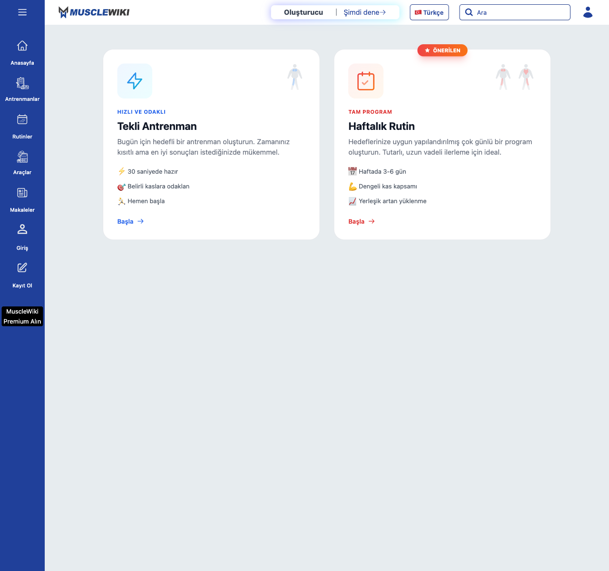
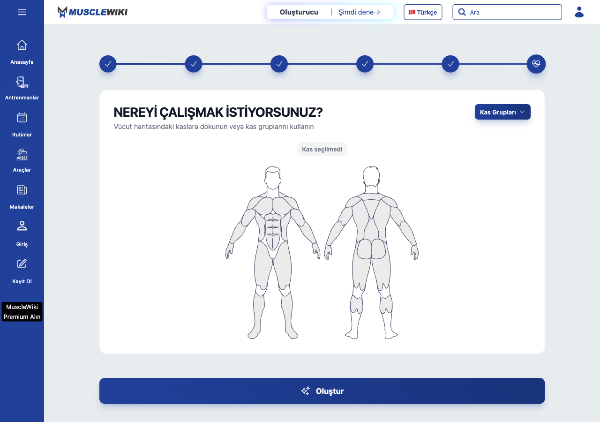
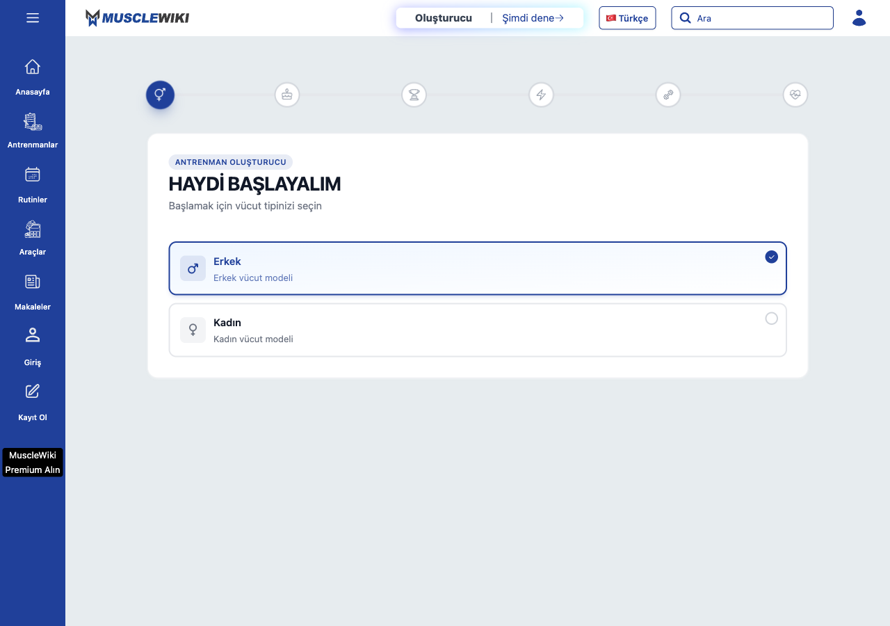
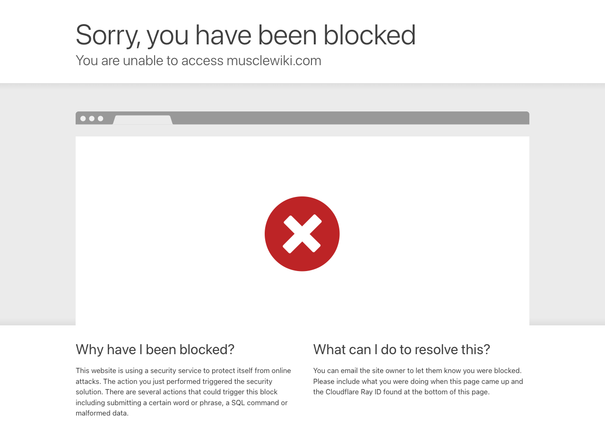
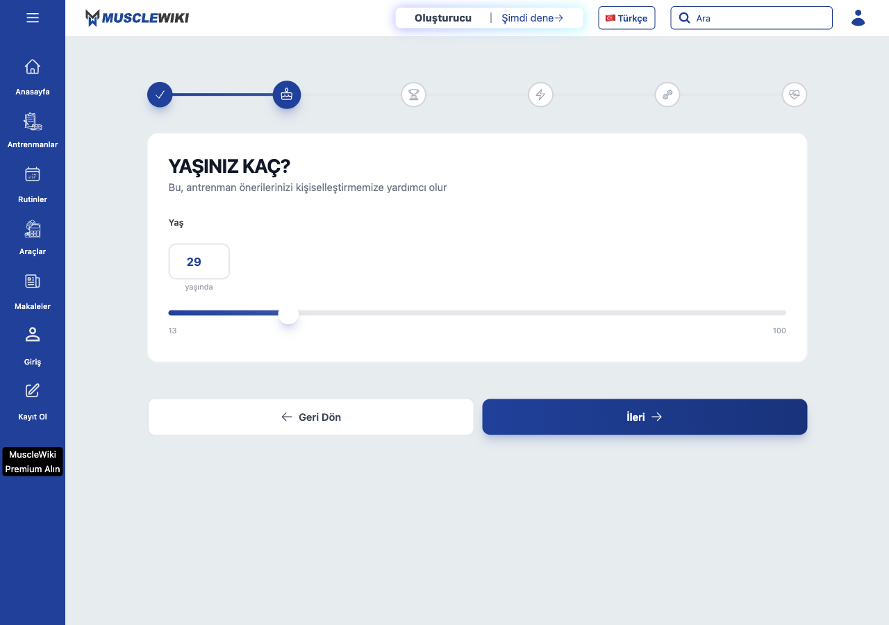
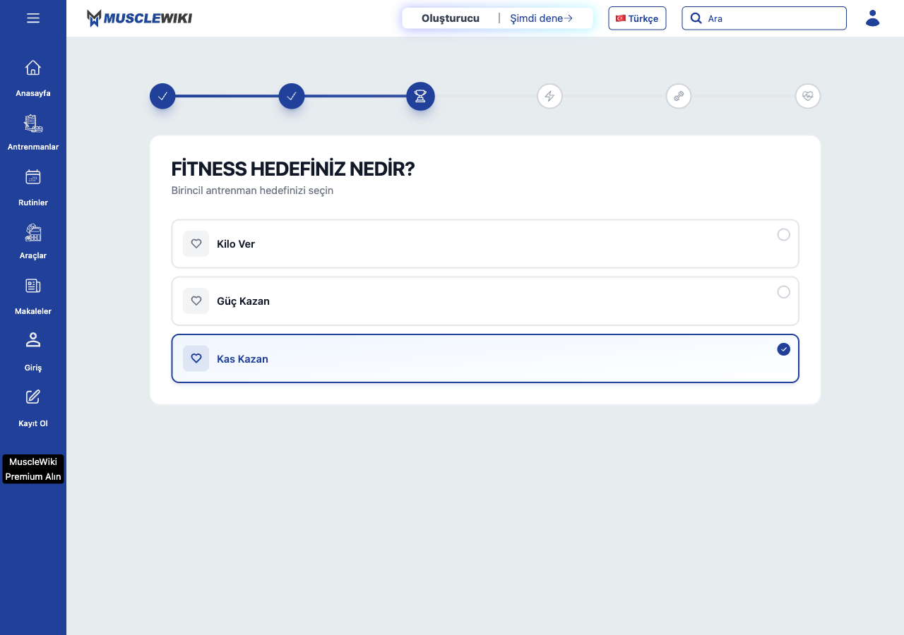
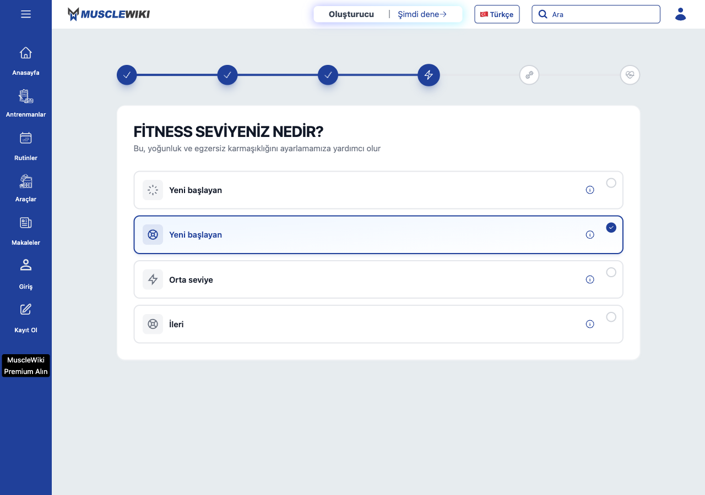
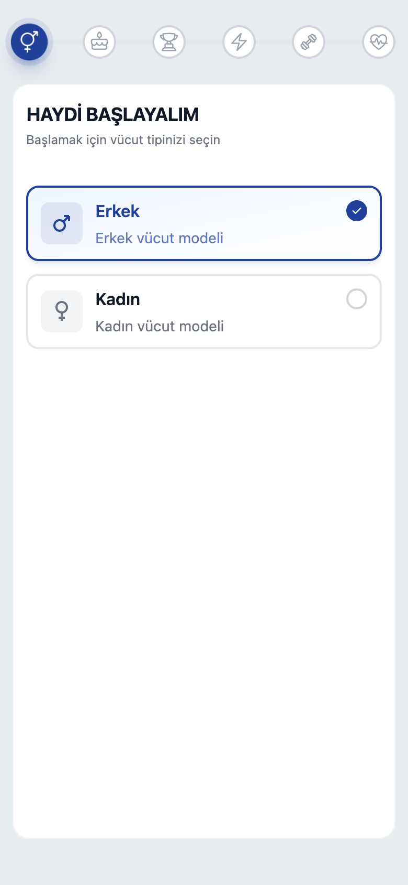

# H3 · MuscleWiki Antrenman Oluşturucu — Keşif Kaydı

> **Durum: KISMİ KEŞİF.**
> **Tamamlanan kesintisiz tam tur: 0.** Sihirbazın **6 adımının 6'sı da**
> tek tek görüldü ve görüntülendi — ama **kesintisiz tur atarak değil**,
> her adımın **kendi route'una ayrı ayrı gidilerek**. **Üretilmiş plan
> ekranı hiç görülmedi**, dolayısıyla **determinizm ölçülemedi**.
>
> Hedef site (`musclewiki.com`) Cloudflare bot koruması arkasında; engel
> **hız tabanlı** çıktı. Engel **aşılmaya çalışılmadı** (brief'in şartı) —
> yalnız istekler arasına bekleme konarak hız sınırına uyuldu.
> Boşluklar uydurulmadı.

## Kaynak etiketleri — bu belgeyi okurken şart

| Etiket | Anlamı | Güven |
|---|---|---|
| **[EKRAN]** | Tarayıcıda **gözle görüldü**, **görüntüsü var**, ve oraya sihirbazın **doğal giriş noktasından** ulaşıldı | Kesin |
| **[ROUTE]** | Tarayıcıda **gözle görüldü**, **görüntüsü var** — ama oraya **route'a doğrudan gidilerek** ulaşıldı, **kesintisiz tur atılarak değil**. Adımın **kendi içeriği kesin**; ama önceki adımların seçimi taşınmadığı için *"şu seçimle bu adım nasıl görünür"* bilgisi vermez | Kesin (içerik) · yok (durum aktarımı) |
| **[KAYNAK]** | Sitenin **kendi sunduğu** dosyadan okundu (ilk sayfa yükünde gelen i18n sözlüğü + `_next/static/chunks/*.js`). **Ekranda doğrulanmadı** | Yüksek — düzen bilgisi vermez, **ve arayüz metniyle çelişebilir** (§3 adım 3'te kanıtlandı) |
| **🚫 ERİŞİLEMEDİ** | Hiç görülemedi | — |

**Neden bu ayrım şart:** [ROUTE] ile görülen bir adımın **kendi** yapısı
(soru metni, seçenek listesi, kart ölçüsü, düğmeler) kesindir. Ama sihirbaz
durumu Redux store'da tutulduğu ve doğrudan navigasyonda **boş başladığı**
için, *"Tur 1'in seçimleriyle bu adım nasıl görünürdü"* sorusu [ROUTE] ile
**cevaplanamaz**. §4'teki turlar bu yüzden **tam tur sayılmıyor**.

**[KAYNAK]** verisi tahmin değil — sayfanın kendi çalışması için indirdiği
dosyalardan birebir okundu. Ama §3 adım 3'te görüldüğü gibi **arayüzdeki
metinden farklı olabiliyor**; çakışma varsa **[EKRAN]/[ROUTE] kazanır**.

---

## 1 · Yöntem

| Kalem | Değer |
|---|---|
| Tarih | 2026-08-20 |
| Araç | Playwright (playwright-core 1.62.1), `tests/_pw.mjs` çözücüsü |
| Tarayıcı | Gerçek Google Chrome (`channel:'chrome'`), headless **ve** başlı mod |
| Viewport | 1280×900 (masaüstü) · 390×844 (mobil, `isMobile+hasTouch`, DPR 2) |
| Locale | `tr-TR`, hedef `https://musclewiki.com/tr-tr/workout-generator` |
| Keşif betikleri | Scratchpad'te tutuldu, **repoya bırakılmadı** |

### Ne oldu — engelin tam kaydı ve çözülen yöntem

1. `/tr-tr/workout-generator` **HTTP 200** ile açıldı. Adım 1 tam olarak
   okundu. **[EKRAN]**
2. Adım 1'de "Erkek" kartına tıklandı → SPA `/workout-generator/age`
   route'una geçti → **HTTP 403, Cloudflare "Sorry, you have been blocked"**.
3. **SPA tıklamasıyla yapılan her geçiş 403 aldı.** Buna karşılık
   **doğrudan navigasyon** (adres çubuğuna route yazmak gibi) geçebiliyordu.
4. Hızlı ardışık istekler blokla sonuçlandı: peş peşe 7 route denendiğinde
   ilki 200, kalan 6'sı 403 döndü.
5. 🔑 **Çözüm — engel aşımı değil, hız sınırına uyum:** her adım için
   **ayrı tarayıcı oturumu**, **tek** istek, oturumlar arasında **3,5 dakika**
   bekleme. Bu düzenle **6 adımın 6'sı da 200 alındı ve ekran görüntüsü
   kaydedildi**.
6. **Sonuç ekranı yine de alınamadı** — sebebi blok değil, mimari:
   seçimler Redux store'da tutuluyor ve doğrudan navigasyonda store boş
   başlıyor. Sonuç ekranını görmek altı adımın **aynı oturumda** ardışık
   tamamlanmasını gerektiriyor — bu da tam olarak 403'e yol açan desen.
7. Ana sayfa `/tr-tr` ve tüm `/api-next/*` uçları **403** kaldı.

### Blok sayacı ve bekleme maliyeti

| Kalem | Sayı |
|---|---|
| **Toplam 403 / blok sayfası alınan istek** | **13** |
| — SPA tıklamasıyla geçiş denemesi | 3 |
| — hızlı ardışık route taraması (tek seferde 7 route) | 6 |
| — `/api-next/*` uç denemeleri | 2 |
| — ana sayfa `/tr-tr` denemeleri | 2 |
| **Kasıtlı bekleme (hız sınırına uyum)** | **≈ 45 dakika** |
| — adım toplama, 6 hedef × 3,5 dk | ≈ 21 dk |
| — sonuç ekranı denemeleri, 2 × 3,5 dk | 7 dk |
| — ilk geri çekilme ve yoklamalar | ≈ 17 dk |
| **`musclewiki.com`'a atılan toplam istek** | ~30 sayfa isteği |

**Ne işe yaradı:** oturum başına tek istek + 3,5 dk bekleme → **6/6 adım alındı.**
**Ne işe yaramadı:** SPA tıklaması (her seferinde 403), hızlı ardışık tarama.
**Denenmedi:** proxy/IP rotasyonu, UA rotasyonu, captcha çözme, insan
davranışı taklidi (fare hareketi simülasyonu **başlatıldı ve harness
tarafından engellendi**; ısrar edilmedi, bu zaten brief'in sınırıydı).

**Denenmeyenler — bilerek:** stealth yaması, `navigator.webdriver` gizleme,
UA sahteciliği, IP değiştirme, CAPTCHA çözme, insan davranışı taklidi
(fare hareketi simülasyonu denendi ve **harness tarafından engellendi** —
bu zaten brief'in çizdiği sınır, ısrar edilmedi).

**Kullanılan meşru kaynak:** sayfa açılırken tarayıcının **zaten indirdiği**
kendi dosyaları — gömülü i18n sözlüğü (131 anahtar) ve 46 JS chunk'ından
adım tanımlarını içeren 11 tanesi. Bu bir koruma aşımı değil; sayfanın
normal yükünde gelen veriyi okumaktır.

### 📊 Bilanço — neyin kanıtı var

**Adım bazında (sihirbaz 6 adım + sonuç):**

| Adım | Route | Etiket | Görüntü |
|---|---|---|---|
| 1 · Cinsiyet | `/workout-generator` | **[EKRAN]** | ✅ masaüstü + mobil |
| 2 · Yaş | `/age` | **[ROUTE]** | ✅ |
| 3 · Hedef | `/fitness-goal` | **[ROUTE]** | ✅ |
| 4 · Seviye | `/fitness-level` | **[ROUTE]** | ✅ |
| 5 · Ekipman | `/equipment` | **[ROUTE]** | ✅ |
| 6 · Hedef kaslar | `/targeted-muscles` | **[ROUTE]** | ✅ |
| **7 · Üretilen plan** | `/workout-results` | **🚫 ERİŞİLEMEDİ** | ❌ *(boş store nedeniyle mod seçim sayfasına yönlendirdi — §2.2)* |

**Sayım: 1 adım [EKRAN] · 5 adım [ROUTE] · sonuç ekranı erişilemedi.**
Sihirbazın **her adımının içeriği kanıtlandı**; **üretilen planın yapısı
kanıtlanmadı**.

**Tur bazında (brief'in 9 turluk matrisi):**

| Tur | Hedeflenen yol | Sonuç |
|---|---|---|
| 1 | Erkek · başlangıç · kilo verme · ev · 3 gün | ⚠️ **Tam tur DEĞİL.** 6 adımın 6'sı [ROUTE] ile görüldü, sonuç alınamadı |
| 2 | Kadın · başlangıç · kilo verme · ev · 3 gün | 🚫 Cinsiyet değişiminin sonraki adımlara etkisi **görülemedi** (durum taşınmıyor) |
| 3 | Erkek · ileri · kas kazanma · salon · 5–6 gün | 🚫 ERİŞİLEMEDİ |
| 4 | Kadın · orta · güç · salon · 4 gün | 🚫 ERİŞİLEMEDİ |
| 5 | Alt sınır (en az gün/ekipman) | 🚫 ERİŞİLEMEDİ |
| 6 | Üst sınır (en çok gün/tüm ekipman) | 🚫 ERİŞİLEMEDİ |
| 7 | Geri dön / seçim değiştir / durum korunuyor mu | ⚠️ **Kısmen** — düğmelerin varlığı/konumu **[ROUTE]** ile görüldü; durum korunması **[KAYNAK]**'tan (§4 Tur 7) |
| 8 | @390 mobil tam tur | ⚠️ **Yalnız adım 1** — mobil düzen kaydedildi |
| 9 | Tur 1'in birebir tekrarı → determinizm | 🚫 ERİŞİLEMEDİ — sonuç ekranı hiç görülmedi (§6) |

> **Tamamlanan kesintisiz tam tur: 0.** Brief'in istediği anlamda
> ("baştan sona tıklayarak") **hiçbir tur tamamlanmadı.** Elde edilen şey
> **adım adım envanter**, tur kaydı değil.

---

## 2 · Adım grafiği

Adım dizisi ve route'ları sitenin kendi `progressButtons` dizisinden
birebir alındı. **[KAYNAK]**

```
                    ┌─────────────────────────────────────────┐
                    │  /tr-tr/workout-generator               │  ilerleme 0
   ADIM 1  Cinsiyet │  "HAYDİ BAŞLAYALIM"                     │  needButton: false
                    │  alan: gender                           │  → seçince 150 ms
                    └────────────────┬────────────────────────┘     sonra otomatik geçer
                                     ▼
                    ┌─────────────────────────────────────────┐
   ADIM 2  Yaş      │  …/age    "YAŞINIZ KAÇ?"                │  ilerleme 20
                    │  alan: age                              │  needButton: TRUE
                    └────────────────┬────────────────────────┘     → İleri'ye basılmalı
                                     ▼
                    ┌─────────────────────────────────────────┐
   ADIM 3  Hedef    │  …/fitness-goal                         │  ilerleme 40
                    │  "FİTNESS HEDEFİNİZ NEDİR?"             │  needButton: false
                    │  alan: goal                             │
                    └────────────────┬────────────────────────┘
                                     ▼
                    ┌─────────────────────────────────────────┐
   ADIM 4  Seviye   │  …/fitness-level                        │  ilerleme 60
                    │  "FİTNESS SEVİYENİZ NEDİR?"             │  needButton: false
                    │  alan: fitness_level                    │
                    └────────────────┬────────────────────────┘
                                     ▼
                    ┌─────────────────────────────────────────┐
   ADIM 5  Ekipman  │  …/equipment  "EKİPMANINIZI SEÇİN"      │  ilerleme 80
                    │  alan: equipment_id_list  (ÇOKLU seçim) │  needButton: TRUE
                    └────────────────┬────────────────────────┘
                                     ▼
                    ┌─────────────────────────────────────────┐
   ADIM 6  Kaslar   │  …/targeted-muscles                     │  ilerleme 100
                    │  "NEREYİ ÇALIŞMAK İSTİYORSUNUZ?"        │  needButton: false
                    │  alan: muscles_id_list   (ÇOKLU seçim)  │  + "Oluştur" düğmesi
                    └────────────────┬────────────────────────┘
                                     ▼
                          [ "Oluştur" — 5 alan da dolu mu? ]
                            │ evet                 │ hayır
                            ▼                      ▼
                    /workout-results        Modal: "Lütfen anketi tamamlayın"
                    (sonuç ekranı)          (adım atlanamaz)
```

**Dallanma yok.** Altı adım tek hat üzerinde ilerliyor; hiçbir seçim
başka bir adım yoluna sapmıyor. Cinsiyet seçimi yalnız gövde haritası
görselini ve seviye açıklama tablosunu değiştiriyor (`levelMale*Info` ↔
`levelFemale*Info`), akışı değiştirmiyor. **[KAYNAK]**

### Sitenin kendi adım tanımı — birebir alıntı **[KAYNAK]**

```js
[{ value:0,   link:"",                 field:"gender",            needButton:false },
 { value:20,  link:"age",              field:"age",               needButton:true  },
 { value:40,  link:"fitness-goal",     field:"goal",              needButton:false },
 { value:60,  link:"fitness-level",    field:"fitness_level",     needButton:false },
 { value:80,  link:"equipment",        field:"equipment_id_list", needButton:true  },
 { value:100, link:"targeted-muscles", field:"muscles_id_list",   needButton:false }]
```

`value` = ilerleme yüzdesi. `needButton` = o adımda **İleri düğmesi
gerekiyor mu**; false olan adımlarda **seçim yapmak tek başına** sonraki
adıma geçiriyor.

---

## ⚠️ 2.1 · Brief'in tur matrisi ile gezilen akış arasındaki SAPMA

Brief'in tur matrisi, **gezilen `/workout-generator` akışında** karşılığı
olmayan eksenler içeriyor. *(Bu bölüm yalnız **bu kol** için geçerlidir —
§2.2 tabloyu önemli ölçüde niteliyor, ikisi birlikte okunmalı.)*

| Brief'in matrisindeki eksen | MuscleWiki'de var mı? | Kanıt |
|---|---|---|
| Cinsiyet (Erkek/Kadın) | ✅ **Var** — adım 1 | **[EKRAN]** |
| Seviye (başlangıç/orta/ileri) | ✅ **Var** — adım 4, ama **4 seçenek** ve ikisi aynı etiketli | **[ROUTE]** |
| Hedef (kilo verme/kas/güç) | ✅ **Var** — adım 3, tam 3 seçenek | **[ROUTE]** |
| Ekipman (ev/salon) | ✅ **Var** — adım 5, ama **ekipman ekipman** seçiliyor; "ev/salon" kısayolu yok, "Vücut Ağırlığı" kalemi var | **[ROUTE]** |
| **Haftada kaç gün (3/4/5–6)** | ❌ **Bu kolda YOK** — ⚠️ **ama MuscleWiki'nin diğer kolunda VAR, bkz. §2.2** | **[ROUTE]** — `progressButtons` 6 kalem, API payload'ında gün alanı yok |
| **Yaş** | ➕ **Var ama brief'te yok** — adım 2, zorunlu, 13–100 | **[ROUTE]** |
| **Hedef kaslar** | ➕ **Var ama brief'te yok** — adım 6, gövde haritasından çoklu seçim | **[ROUTE]** |

**Doğrulama:** MuscleWiki'nin plan üretme API'sine gönderdiği gövde
(sitenin kendi kodundan birebir): **[KAYNAK]**

```js
{ equipment_id_list, muscles_id_list, gender, age, fitness_level, mobile, goal }
```

Yedi alan. **Gün sayısı alanı yok.** Yani `/workout-generator` kolu
**haftalık bölünme üretmiyor** — tek bir antrenman seansı üretiyor.

### ⚠️ Bu bölümün sınırı

Yukarıdaki tablo yalnız **gezilen `/workout-generator` (Tekli Antrenman)
akışı** için geçerlidir. **§2.2 okunmadan bu bölümden hüküm çıkarılmamalı** —
MuscleWiki'nin gün eksenli ikinci bir oluşturucu kolu var ve brief'in
istediği çıktıya asıl o karşılık geliyor.

---

## 🔍 2.2 · MuscleWiki'de İKİ AYRI oluşturucu kolu var — **[ROUTE]**

Keşfin **en geç ve en önemli bulgusu.** `/tr-tr/workout-results` doğrudan
açılmaya çalışıldığında (store boş olduğu için) `/tr-tr/generator`
sayfasına **yönlendirdi** ve oluşturucunun **giriş/mod seçim ekranı**
ortaya çıktı:



**İki kart, iki ayrı akış:**

| | **Tekli Antrenman** | **Haftalık Rutin** |
|---|---|---|
| Üst etiket | `HIZLI VE ODAKLI` (mavi) | `TAM PROGRAM` (kırmızı) + **★ ÖNERİLEN** rozeti |
| Açıklama | "Bugün için hedefli bir antrenman oluşturun. Zamanınız kısıtlı ama en iyi sonuçları istediğinizde mükemmel." | "Hedeflerinize uygun yapılandırılmış **çok günlü** bir program oluşturun. Tutarlı, uzun vadeli ilerleme için ideal." |
| Madde 1 | ⚡ 30 saniyede hazır | 📅 **Haftada 3-6 gün** |
| Madde 2 | 🎯 Belirli kaslara odaklan | 💪 Dengeli kas kapsamı |
| Madde 3 | 🏃 Hemen başla | 📈 Yerleşik artan yüklenme |
| Kart görseli | **1** küçük gövde | **2** gövde, kırmızı vurgulu |
| Eylem | "Başla →" | "Başla →" |
| **Keşif durumu** | ✅ **Bu keşfedildi** — §2.1'in 6 adımı bu koldur | 🚫 **HİÇ KEŞFEDİLMEDİ** |

### ⚠️ §2.1'in düzeltilmesi

§2.1'de *"gün sayısı ekseni MuscleWiki'de YOK"* denmişti. **Doğrusu:**

- **`/workout-generator` (Tekli Antrenman) akışında gün ekseni gerçekten yok** —
  bu, §2.1'de yazılanların tamamı için geçerli ve **doğru**.
- **Ama MuscleWiki'de gün ekseni VAR** — "Haftalık Rutin" kolunda,
  ve kartında açıkça **"Haftada 3-6 gün"**, **"Dengeli kas kapsamı"**,
  **"Yerleşik artan yüklenme"** yazıyor.

Yani gezilen 6 adımlık sihirbaz, MuscleWiki'nin **hızlı** koluymuş.
Brief'in H3 için istediği *"gün gün hareket listesi"*, *"3 gün → full body,
5–6 gün → push/pull/legs"* ve *"artan yüklenme"* kavramları **MuscleWiki'nin
Haftalık Rutin kolunda karşılığı olan** kavramlar.

> 🔴 **Bu kol hiç keşfedilmedi.** Adım sayısı, adım sırası, gün seçim
> widget'ı, bölünme mantığı, çıktı yapısı — **hiçbiri bilinmiyor.**
> H3'ün asıl referansı büyük olasılıkla **bu kol**, keşfedilen kol değil.
> Bkz. §10 **AS-1**.

**Not:** `/tr-tr/generator` sayfası bu keşifte **kazara** bulundu; kaynak
koddaki route listesinde `/generator` görünüyordu ama işlevi bilinmiyordu.
Şimdi biliniyor: **oluşturucunun gerçek giriş kapısı burası**,
`/workout-generator` değil.

---

## 3 · Seçenek matrisi

> **Bu bölümün okunma sınırı.** Adım 2–6 **[ROUTE]** ile görüldü: her adımın
> **soru metni, seçenek listesi, kart ölçüsü ve düğmeleri kesindir** —
> ekranda sayıldı ve görüntülendi. **Ama** her biri **boş durumla** açıldı.
> Bu bölümden **öğrenilemeyecek** iki şey:
> ① Önceki adımın seçimi bu adımı değiştiriyor mu (ör. cinsiyet → gövde
> haritası varyantı, ekipman → kas listesi süzmesi) — **bilinmiyor**.
> ② *"İlk açılışta şu seçili geliyor"* notları **boş durumun varsayılanıdır**,
> gerçek bir turun ortasındaki durum değil.

Etiketler **ekranda sayıldı**; sözlükle çeliştiği yerler ayrıca işaretlendi.

### Adım 1 · Cinsiyet Seç — **[EKRAN]** ✅ tam doğrulandı

| # | Etiket | Açıklama satırı | İkon |
|---|---|---|---|
| 1 | **Erkek** | "Erkek vücut modeli" | ♂ yuvarlak rozet içinde |
| 2 | **Kadın** | "Kadın vücut modeli" | ♀ yuvarlak rozet içinde |

- Üst rozet: `ANTRENMAN OLUŞTURUCU` · H1: `HAYDİ BAŞLAYALIM`
- Alt metin: `Başlamak için vücut tipinizi seçin`
- Grup başlığı: `Cinsiyet Seç`
- **"Erkek" varsayılan olarak seçili geliyor** (sayfa ilk açılışta, hiç
  tıklanmadan). Bu ekranda doğrulandı.
- `role="radiogroup"`, `aria-labelledby="gender-selection-label"` **[KAYNAK]**

### Adım 2 · Yaş — **[ROUTE]** ✅ içeriği doğrulandı

| Kalem | Değer |
|---|---|
| Soru | **YAŞINIZ KAÇ?** |
| Alt metin | "Bu, antrenman önerilerinizi kişiselleştirmemize yardımcı olur" |
| Alan etiketi | "Yaş" · birim "yaşında" |
| **Widget** | **İKİ girdi birden, aynı değere bağlı:** `<input type="number">` **+** `<input type="range">` (kaydırıcı) |
| **Aralık** | **min = 13 · max = 100** (ikisinde de) |
| **Varsayılan değer** | **29** — sayfa açılışta dolu geliyor |
| Kaydırıcı uçları | Altında "13" ve "100" yazıyor |
| Zorunlu mu | Evet — ama **varsayılan dolu** olduğu için pratikte hiç boş kalmıyor |
| İleri düğmesi | **Var ve açılışta ETKİN** (`disabled: false`) — çünkü değer zaten dolu |
| **Geri Dön düğmesi** | **Var** — 472×56 px, x=212, **y=573** (kartın altında) |
| İlerleme rayı | **2. nokta aktif** ve **büyümüş** (40×40); 1. nokta 37×37'ye küçülmüş — aktif noktanın büyüdüğü böylece doğrulandı |
| URL | `/tr-tr/workout-generator/age` |

**Alt bar düzeni doğrulandı:** "Geri Dön" ve "İleri" **yan yana**, her biri
**472 px** — yani panelin (946 px) tam **yarısı**. `flex-1` yorumu
ekranda teyit edildi. İkisi de **56 px yüksek**.

> **H3 için doğrudan alınabilir fikir:** sayı girdisi **ve** kaydırıcıyı
> aynı değere bağlamak — klavyeyle kesin değer girmek isteyen de,
> sürükleyip geçmek isteyen de karşılanıyor. Erişilebilirlik açısından da
> doğru (kaydırıcı tek başına ekran okuyucuda zayıf kalır).

### Adım 3 · Hedef — **[ROUTE]** ✅ içeriği doğrulandı

Soru: **FİTNESS HEDEFİNİZ NEDİR?** · Alt metin: "Birincil antrenman hedefinizi seçin"

| # | **Ekrandaki etiket** | Sözlükteki karşılığı | Açıklama satırı ekranda |
|---|---|---|---|
| 1 | **Kilo Ver** | `goalWeight` "Kilo Ver" ✅ aynı | ❌ gösterilmiyor |
| 2 | **Güç Kazan** | `goalStrength` "Güç Kazan" ✅ aynı | ❌ gösterilmiyor |
| 3 | **Kas Kazan** | `goalBuild` "Kas **Yap**" ⚠️ **farklı** | ❌ gösterilmiyor |

**Tam olarak 3 seçenek var** — ekranda sayıldı. Sözlükte tanımlı açıklama
satırları (`goalWeightDesc` = "Kilo ver ve vücut kompozisyonunu iyileştir"
vb.) **arayüzde kullanılmıyor**. Üç kart da **aynı kalp ikonunu** taşıyor.

> ⚠️ Etiketler API'den (`/api-next/goals`) geliyor ve **gömülü sözlükten
> farklı olabiliyor** ("Kas Yap" ≠ "Kas Kazan"). Bu yüzden bu belgede
> **[KAYNAK]** etiketli metinler *kesin arayüz metni* sayılmamalı.

### Adım 4 · Seviye — **[ROUTE]** ✅ içeriği doğrulandı

Soru: **FİTNESS SEVİYENİZ NEDİR?** · Alt metin: "Bu, yoğunluk ve egzersiz
karmaşıklığını ayarlamamıza yardımcı olur"

**Ekranda 4 seçenek var:**

| # | Ekrandaki etiket | ⓘ bilgi düğmesi |
|---|---|---|
| 1 | **Yeni başlayan** | ✅ var |
| 2 | **Yeni başlayan** ← 🔴 **birinciyle AYNI etiket** | ✅ var |
| 3 | **Orta seviye** | ✅ var |
| 4 | **İleri** | ✅ var |

> 🔴 **MuscleWiki'nin Türkçe çevirisinde gerçek bir hata var:** ilk iki
> seçenek **aynı etiketi** taşıyor ("Yeni başlayan"). Sözlükte `levelNovice`
> ("Acemi") ve `levelBeginner` ("Başlangıç") **ayrı** tanımlı, ama API'den
> gelen Türkçe etiketler ikisini de "Yeni başlayan" yapmış. Kullanıcı
> ayırt edemiyor — yalnız ⓘ düğmesine basarsa farkı görüyor.
>
> **H3 için ders:** MuscleWiki'nin etiketleri **körü körüne alınmayacak.**
> Bu, "referansı birebir uyarla" talimatının sınırı: **referansın hatası
> kopyalanmaz.**

**ⓘ bilgi düğmesi doğrulandı:** her kartın **sağ tarafında**, radyo
işaretinin **solunda** küçük bir ⓘ ikonu var. Sözlükteki ölçüt tablolarını
(`levelBeginnerInfo` vb. — salon ayı, şınav sayısı, bench/squat oranları)
açan düğme bu. §9'da "alınacaklar" listesindeki 5 numaralı desen
**ekranda teyit edildi**.

Yardım metni: "Kişiselleştirilmiş antrenman önerileri almak için fitness
seviyenizi seçin." (sözlükte var, ekranda alt metin farklı)

**Ayırt edici desen:** her seviyenin yanında bir **"Bilgi"** düğmesi var ve
açılan kutuda o seviyenin **somut ölçütleri** listeleniyor — salon ayı,
mil koşu süresi, şınav/barfiks sayısı, bench/squat/deadlift'in vücut
ağırlığına oranı. Ve bu tablo **cinsiyete göre değişiyor**
(`levelMaleBeginnerInfo` ≠ `levelFemaleBeginnerInfo`). Üstünde bir de
**"Sorumluluk Reddi"** metni duruyor. Bu, "seviye seç" adımını tahminden
çıkarıp ölçülebilir hale getiren güçlü bir fikir — **H3 için alınmaya
değer** (bkz. §9).

> Telif notu: bu ölçüt tabloları **kopyalanmayacak**. Alınan şey
> "seviye adımına ölçütlü bilgi kutusu koy" **fikri**; DadaFit'in
> kendi eşikleri kendi editoryal kararıyla yazılacak.

### Adım 5 · Ekipman — **[ROUTE]** ✅ içeriği doğrulandı

| Kalem | Değer |
|---|---|
| Soru | **EKİPMANINIZI SEÇİN** |
| Alt metin | "Erişiminiz olan tüm ekipmanları seçin" |
| Seçim türü | **Çoklu** (`equipment_id_list`) |
| Sayaç | Sağ üstte hap rozet — 🔴 **"0 selected"** (İngilizce kalmış, çeviri eksiği) |
| Zorunlu mu | Evet — ama **İleri düğmesi 0 seçimle bile ETKİN**; doğrulama sonda ("Oluştur"da) yapılıyor |
| Geri / İleri | ✅ **Var** — `needButton:true` ekranda doğrulandı |

**Ekipman listesi — ekranda sayılan tam liste (7 kalem + 1 kısayol):**

| # | Etiket | Not |
|---|---|---|
| — | **Tümünü Seç** | Ayrı düğme **değil** — ızgaranın **ilk kartı** olarak duruyor |
| 1 | **Halter** | barbell |
| 2 | **Dambıllar** | dumbbells |
| 3 | **Vücut Ağırlığı** | ⭐ ekipmansız seçeneği **bu** |
| 4 | **Makine** | machine |
| 5 | **Kettlebelller** | 🔴 yazım hatası — üç "l" |
| 6 | **Kablolar** | cables |
| 7 | **Bant** | bands |

🔴 **Üçüncü çeviri/yazım hatası** bu adımda: sayaç İngilizce ("0 selected"),
"Kettlebelller" üç l'li. **H3 referansın metnini kopyalamayacak** (§3 adım 4).

#### 🔴 Düzen tamamen değişiyor — keşfin ikinci önemli bulgusu

| | Adım 1/3/4 (az seçenek) | **Adım 5 (çok seçenek)** |
|---|---|---|
| Sütun | **1** | **5** |
| Kart ölçüsü | 890×70…78 | **169×96** |
| Kart yönü | **Yatay** — ikon sol, metin orta, radyo sağ | **Dikey** — ikon üstte, etiket altta ortalı |
| Açıklama satırı | yalnız adım 1'de | yok |

MuscleWiki **adıma göre düzen değiştiriyor**: 2–4 seçenekli adımlarda geniş
yatay kartlar, 8 seçenekli adımda 5 sütunlu ikon ızgarası. §9'daki
"adıma göre sütun sayısı" önerisi **ekranda doğrulandı**.

**Brief'in "ev / salon" ekseniyle örtüşmüyor:** kısayol yok, ekipmanlar
tek tek işaretleniyor. Ama **"Vücut Ağırlığı"** kalemi, brief'in
*"ev/ekipmansız seçildiyse barbell çıkmayacak"* şartının MuscleWiki'deki
karşılığı — sapma §2.1'de kayıtlı.

### Adım 6 · Hedef kaslar — **[ROUTE]** ✅ içeriği doğrulandı

| Kalem | Değer |
|---|---|
| Soru | **NEREYİ ÇALIŞMAK İSTİYORSUNUZ?** |
| Alt metin | **"Vücut haritasındaki kaslara dokunun veya kas gruplarını kullanın"** |
| Seçim türü | **Çoklu** (`muscles_id_list`) |
| Boş durum rozeti | **"Kas seçilmedi"** — haritanın **üstünde ortalı** hap rozet |
| İkinci giriş yolu | **"Kas Grupları ⌄"** düğmesi — **sağ üstte**, başlıkla aynı hizada, açılır menü oku ile |
| **Geri Dön** | 🔴 **YOK** — bu adımda yalnız "Oluştur" var |
| Ana eylem | **"Oluştur"** — ✨ ikonlu, **tam genişlik** (948 px), kartın **dışında**, koyu mavi degrade |
| İlerleme rayı | 5 adım ✓ tik, 6. nokta aktif (kalp ikonu) |



#### Gövde haritası — ekranda doğrulanan yapı

- 🔴 **ÖN ve ARKA gövde YAN YANA**, tek ekranda. **Sekme yok, çevirme yok.**
  (Kaynak koddan çıkarılan bulgu **ekranda teyit edildi**.)
- Gövdeler **çizgisel (outline)**, açık gri dolgulu, koyu ince kontur.
- Cinsiyet adımındaki seçime göre çiziliyor (bu turda **erkek**).
- Panel içinde **ortalanmış**, ikisi birlikte ~400 px genişlik kaplıyor.

#### 🎯 Gerçek kas bölgesi id listesi — SVG'den birebir okundu

**H2 için en değerli çıktı.** Sözlükteki 10 kas değil, **17 kas bölgesi +
8 eklem** var:

**Ön gövde — kas bölgeleri (10):**
`chest` · `abdominals` · `obliques` · `biceps` · `forearms` ·
`front-shoulders` · `traps` · `quads` · `calves` · `hands`

**Arka gövde — kas bölgeleri (11):**
`lats` · `traps` · `traps-middle` · `rear-shoulders` · `triceps` ·
`forearms` · `lowerback` · `glutes` · `hamstrings` · `calves` · `hands`

**Benzersiz kas bölgesi sayısı: 17**
(`chest`, `abdominals`, `obliques`, `biceps`, `triceps`, `forearms`,
`front-shoulders`, `rear-shoulders`, `traps`, `traps-middle`, `lats`,
`lowerback`, `quads`, `hamstrings`, `glutes`, `calves`, `hands`)

**Eklem bölgeleri — ayrı `joints` katmanı (8):**
`shoulders` · `elbow` · `wrist` · `hips` · `knees` · `ankles` ·
`upper-spine` · `lower-spine` · `scapula`

Ayrıca `body` id'li bir grup var — gövde silueti (tıklanabilir bölge değil).

> **Doğrulandı:** `updateBodyMapColors` fonksiyonunun `bodymap` / `joints`
> ikili modu gerçek — SVG **aynı gövde üzerinde iki katman** taşıyor:
> kas katmanı ve eklem katmanı.

**Sözlükteki 10 Türkçe kas etiketi** (haritadaki 17 bölgenin bir alt kümesi):

| Anahtar | Türkçe | Haritadaki id |
|---|---|---|
| muscleChest | Göğüs | `chest` |
| muscleBack | Sırt | `lats` / `lowerback` |
| muscleShoulders | Omuzlar | `front-shoulders` / `rear-shoulders` |
| muscleBiceps | Pazı | `biceps` |
| muscleTriceps | Triseps | `triceps` |
| muscleAbs | Karın Kasları | `abdominals` |
| muscleQuads | Kuadriseps | `quads` |
| muscleHamstrings | Hamstringler | `hamstrings` |
| muscleGlutes | Kalça | `glutes` |
| muscleCalves | Baldırlar | `calves` |

**Kas kategorileri (5):** Çekirdek · Üst Vücut · Alt Vücut · Kollar · Bacaklar

> Sözlükte karşılığı **olmayan** harita bölgeleri: `obliques`, `forearms`,
> `traps`, `traps-middle`, `hands`. Yani harita, grup listesinden **daha
> ince** ayrım yapıyor — haritadan seçim daha hassas.

---

## 4 · Tur tur kayıt

> 🔴 **Başlık yanıltmasın: burada kayıtlı olan bir "tur" değil.**
> Brief'in istediği tur, *"seçim yap → ilerle → seçim yap → sonucu gör"*
> zinciridir. **Böyle bir zincir hiç tamamlanmadı.** Aşağıdaki "Tur 1",
> altı adımın **ayrı ayrı ziyaret edilerek** çıkarılmış envanteridir.
> Adımların **kendi yapısı** kanıtlıdır; **aralarındaki durum aktarımı**
> kanıtlı değildir.

### Tur 1 — adım adım envanter (kesintisiz tur DEĞİL)

**Hedeflenen yol:** Erkek · başlangıç · kilo verme · ev · 3 gün
**Gerçekleşen:** 6 adımın 6'sı görüldü, hiçbiri diğerinin seçimini taşımadan;
sonuç ekranı alınamadı.

**Adım 1 · Cinsiyet — [EKRAN] tam kayıt**



| Kalem | Gözlem |
|---|---|
| **İlerleme göstergesi** | **6 yuvarlak ikonlu nokta rayı**, aralarında ince yatay çizgi. Sayfanın **en üstünde**, kartın dışında. Aktif nokta koyu lacivert dolu + hafif büyük (40×40), pasifler beyaz zeminli gri ikon (37×37). Rakam yok, çubuk yok — **ikon + nokta**. Altında yüzde de yazmıyor (yüzde yalnız iç durumda: 0/20/40/60/80/100) |
| **Soru bloğu** | Beyaz, yuvarlatılmış geniş panel (yaklaşık 946 px), ortalanmış |
| **Üst etiket** | `ANTRENMAN OLUŞTURUCU` — küçük, hap biçimli, açık mavi zeminli rozet |
| **Başlık** | `HAYDİ BAŞLAYALIM` — çok büyük, ağır, **eğik (italik)**, tümü büyük harf |
| **Alt metin** | `Başlamak için vücut tipinizi seçin` — gri, küçük |
| **Seçenek düzeni** | **Tek sütun**, tam genişlik yatay kartlar. 890×78 (masaüstü). Kartlar arası ~10 px |
| **Kart yapısı** | ⬅ solda **yuvarlak ikon rozeti** (♂/♀) · ortada **kalın başlık** + altında **gri açıklama satırı** · ➡ sağda **radyo işareti** (seçili: dolu mavi daire + tik, boş: gri halka) |
| **Seçili görünüm** | 2 px **mavi kenarlık** + soldan sağa açılan **hafif mavi degrade zemin** + başlık mavi + ikon rozeti mavi tonlu |
| **Geri / İleri düğmesi** | **Bu adımda YOK.** Seçim yapmak tek başına ilerletiyor |
| **Zorunlu alan** | Cinsiyet — ama **"Erkek" varsayılan seçili** geliyor |
| **URL** | `https://musclewiki.com/tr-tr/workout-generator` (adım eki yok) |
| **Sol kenar** | Site kabuğu: dikey ikon menüsü (Anasayfa · Antrenmanlar · Rutinler · Araçlar · Makaleler · Giriş · Kayıt Ol) — sihirbaza ait değil, site geneli |

**Adım 2 · Yaş — [EKRAN] tam kayıt**

SPA tıklamasıyla geçiş **403** aldı:



Ancak **doğrudan navigasyonla** ve hız sınırına uyularak `/age` **200**
alındı ve adım tam olarak okundu:

| Kalem | Gözlem |
|---|---|
| **İlerleme göstergesi** | 2. nokta aktif ve **40×40'a büyümüş**, 1. nokta 37×37'ye inmiş. Ray konumu aynı (y≈116) |
| **Girdi** | `type="number"` **ve** `type="range"` — **ikisi aynı değere bağlı**, min 13 / max 100, varsayılan **29** |
| **Alt bar** | **"Geri Dön"** (472×56, x=212, y=573) + **"İleri"** yan yana, her biri panelin yarısı |
| **İleri'nin durumu** | **Etkin** — yaş varsayılan dolu geldiği için baştan tıklanabilir |
| **Metin akışı** | "YAŞINIZ KAÇ? / Bu, antrenman önerilerinizi kişiselleştirmemize yardımcı olur / Yaş / yaşında / 13 / 100 / Geri Dön / İleri" |
| URL | `/tr-tr/workout-generator/age` |



**Görüntüden çıkan ek gözlemler:**

- **Sayı kutusu solda ve küçük** (~86×48), içinde **kalın mavi rakam**;
  hemen **altında** küçük gri "yaşında" etiketi. Kutu kaydırıcıdan ayrı bir blok.
- **Kaydırıcı tam panel genişliğinde**, dolu kısmı koyu mavi, tutamağı
  beyaz yuvarlak. Uçlarında küçük gri **13** ve **100**.
- 🔴 **Alt bar KARTIN DIŞINDA.** Panel kaydırıcıdan sonra bitiyor, altında
  ~50 px boşluk, sonra iki düğme geliyor. **R13'ten ayrılan nokta:** R13'ün
  `pb-foot`'u kartın **içinde** ve üstünde `border-top` var.
- **"Adım 2 / 6" sayacı YOK.** İlerleme yalnız nokta rayından okunuyor.
- İlerleme rayında **1. adım artık ✓ tik**, aralarındaki çizgi **koyu mavi dolmuş**.
- Üst rozet "ANTRENMAN OLUŞTURUCU" **bu adımda yok** — yalnız adım 1'de var.

---

**Adım 3 · Hedef — [EKRAN] tam kayıt**



| Kalem | Gözlem |
|---|---|
| Soru | **FİTNESS HEDEFİNİZ NEDİR?** · alt metin "Birincil antrenman hedefinizi seçin" |
| **Seçenekler (ekrandaki gerçek sıra)** | 1. **Kilo Ver** · 2. **Güç Kazan** · 3. **Kas Kazan** |
| Kart ölçüsü | **890×70** — cinsiyet kartından (78) **8 px kısa** |
| Kart aralığı | ~11 px · sol kenar x=242 (adım 1 ile aynı) |
| **Sütun** | **Tek sütun**, tam genişlik |
| 🔴 **Açıklama satırı** | **YOK.** Yalnız ikon + başlık. (Sözlükte `goalWeightDesc` vb. tanımlı ama **ekranda gösterilmiyor**) |
| 🔴 **İkon** | **Üç seçenek de AYNI kalp ikonunu** kullanıyor — ayırt edici değil |
| Seçili görünüm | Mavi 2 px kenarlık + mavi degrade zemin + **mavi başlık** + sağda **dolu mavi tik**; seçili olmayanlarda boş gri halka |
| **Geri / İleri düğmesi** | **YOK** — `needButton:false` doğrulandı. Seçim tek başına ilerletiyor |
| İlerleme rayı | **1. ve 2. adım ✓ tik**, çizgiler dolu, 3. nokta aktif (40×40) |
| İlk açılışta | **"Kas Kazan" seçili** geliyor |

> ⚠️ **Sözlük ↔ ekran farkı:** sözlükte `goalBuild` = "Kas **Yap**",
> ekranda **"Kas Kazan"**. Ekrandaki etiketler API'den (`/api-next/goals`)
> geliyor ve gömülü sözlükten **farklı** olabiliyor. **Ekran kazanır.**
> Bu, §3'te **[KAYNAK]** etiketli diğer etiketlerin de birebir
> güvenilmemesi gerektiğini gösteriyor.

**H3 için iki ders:** ① MuscleWiki hedef adımında açıklama satırını
düşürmüş ve ikonları ayırt etmemiş — **R13 bu ikisini daha iyi yapıyor**
(`{t, d, i}` üçlüsü her seçenekte dolu). H3 **R13'ü izlemeli**, MuscleWiki'yi
değil. ② `needButton` ayrımı ekranda doğrulandı: tek seçimli adımda alt
bar hiç çizilmiyor.

**Adım 4 · Seviye — [EKRAN] tam kayıt**



| Kalem | Gözlem |
|---|---|
| Seçenekler | **4 kart:** "Yeni başlayan" · "Yeni başlayan" · "Orta seviye" · "İleri" |
| Kart ölçüsü | **890×70** — adım 3 ile aynı |
| Sütun | Tek sütun |
| Açıklama satırı | ❌ yok (adım 3 gibi) |
| **ⓘ bilgi düğmesi** | ✅ **her kartta**, sağda, radyo işaretinin solunda |
| İkonlar | Kart başına **farklı** ikon (adım 3'ün aksine) |
| Geri / İleri | **YOK** (`needButton:false`) |
| İlerleme rayı | 1–3 ✓ tik, 4. nokta aktif |
| İlk açılışta | **2. "Yeni başlayan" seçili** |

🔴 **Çeviri hatası ekranda doğrulandı** — ayrıntı §3 adım 4'te.

---

### Tur 2 — Kadın · başlangıç · kilo verme · ev · 3 gün 🚫

Adım 1'de "Kadın" kartı ekranda görüldü ve yapısı Tur 1 ile **birebir aynı**
(890×78, tek sütun, aynı kart iskeleti) **[EKRAN]**. Tıklama sonrası aynı
403 duvarı. Cinsiyetin akışa etkisi **[KAYNAK]**'tan biliniyor: adım
sırası değişmiyor, yalnız gövde haritası görseli ve seviye bilgi tablosu
(`levelFemale*Info`) değişiyor. Kalan adımlar **🚫 ERİŞİLEMEDİ**.

---

### Tur 3 — Erkek · ileri · kas kazanma · salon · 5–6 gün 🚫 ERİŞİLEMEDİ

Adım 2'den öteye geçilemedi. Ayrıca **"5–6 gün" adımı arayüzde yok**
(§2.1) — bu tur mevcut arayüzde zaten birebir yürütülemezdi.

### Tur 4 — Kadın · orta · güç · salon · 4 gün 🚫 ERİŞİLEMEDİ

Aynı gerekçe. "4 gün" ekseni arayüzde yok.

### Tur 5 — Alt sınır (en az gün / en az ekipman) 🚫 ERİŞİLEMEDİ

Alt sınır davranışı hakkında **[KAYNAK]**'tan bilinen tek şey: ekipman
listesi **boş bırakılamıyor** (`equipment_id_list.length > 0` şartı), kas
listesi de boş bırakılamıyor. Yani "hiç ekipman yok" durumu ancak
**ekipmansız hareketler için bir ekipman kalemi seçilerek** ifade
edilebiliyor olmalı — ama o kalemin adı 🚫 doğrulanamadı. **Tek ekipman +
tek kas seçildiğinde plan boş dönüyor mu, 🚫 ERİŞİLEMEDİ.**

### Tur 6 — Üst sınır (tüm ekipman) 🚫 ERİŞİLEMEDİ

**"Tümünü Seç"** düğmesinin varlığı **[KAYNAK]** doğrulandı — üst sınır tek
tıkla kuruluyor. Sonucun nasıl değiştiği 🚫 ERİŞİLEMEDİ.

---

### Tur 7 — Geri dön / seçim değiştir / durum korunuyor mu ⚠️ kısmen

Ekranda yürütülemedi. **[KAYNAK]**'tan kesin olarak çıkarılan davranış:

| Soru | Cevap | Kanıt |
|---|---|---|
| Durum nerede tutuluyor | **Redux store** (`state.workoutGenerator`), adım route'ları arasında ortak | `useAppSelector(e=>e.workoutGenerator.gender)` |
| Geri dönünce seçimler korunuyor mu | **Evet** — store adım değişiminde temizlenmiyor | `updateWorkoutSettings` yalnız ilgili alanı yazıyor |
| Geri düğmesi nerede | **Alt bar**, İleri ile **yan yana** — ikisi de `flex-1` (yarı yarıya genişlik) | `flex-1 flex items-center justify-center gap-2 px-5 py-4` |
| Geri düğmesinin biçimi | Beyaz zemin, gri 2 px kenarlık, koyu gri metin, **← ok ikonu** solda, hover'da ok sola kayıyor | sınıf listesi |
| İleri düğmesinin biçimi | **Mavi degrade** dolgu, beyaz kalın metin, gölge, hover'da yukarı kalkıyor | `bg-gradient-to-r from-mw-blue to-mw-blue-600` |
| Geri düğmesi ilk adımda ne yapıyor | `/workout-generator`'a döner | `push("/workout-generator")` |
| İleri düğmesi ne zaman etkin | Devre dışı stili tanımlı (`disabled:opacity-50 disabled:cursor-not-allowed`) ama **hangi koşulda tetiklendiği 🚫 doğrulanamadı** | — |
| **Seçim değiştirilince ne oluyor** | 🔴 **Üretilmiş plan SİLİNİYOR.** `generated_workout` ve `progress` dışındaki **herhangi** bir alan değişince `generated_workout` `null`'a çekiliyor | `updateWorkoutSettings` gövdesi |

Son satır **H3 için doğrudan bir kural**: kullanıcı sonuç ekranından geri
dönüp bir seçimi değiştirirse, eski plan geçersiz sayılıyor ve yeniden
üretilmesi gerekiyor. Bayat plan gösterilmiyor.

---

### Tur 8 — @390 mobil ⚠️ yalnız adım 1



| Kalem | @390 gözlemi **[EKRAN]** |
|---|---|
| **Yatay taşma** | **0 px** (`scrollWidth − clientWidth = 0`) |
| **İlerleme rayı** | Yine **6 nokta, tek satırda**, sarmıyor. Aktif 35×35, pasifler 32×32. x: 10 → 346, aralık ~67 px. Sayfanın en üstünde (y≈24) |
| **Seçenek kartları** | **Tek sütun** (masaüstüyle aynı) · **340×72** · x=25 · aralık 12 px |
| **Kart yüksekliği** | 78 → 72 px'e iniyor, iskelet değişmiyor |
| **Üst rozet** | `ANTRENMAN OLUŞTURUCU` rozeti mobilde **görünmüyor** (DOM metninde yok) |
| **Başlık/alt metin** | Aynı: `HAYDİ BAŞLAYALIM` + `Başlamak için vücut tipinizi seçin` |
| **Sol dikey menü** | Mobilde gizli, hamburger'e dönüyor |

**Kritik gözlem:** masaüstünde de mobilde de **tek sütun**. MuscleWiki bu
adımda hiç ızgaraya geçmiyor — kartlar her ölçüde tam genişlik. Adım 3–6'nın
sütun sayısı 🚫 ERİŞİLEMEDİ.

### Ölçülen değerler — H3 kodunun doğrudan kullanabileceği sayılar **[EKRAN]**

| Kalem | @1280 | @390 |
|---|---|---|
| İlerleme noktası — aktif | 40×40 | 35×35 |
| İlerleme noktası — pasif | 37×37 | 32×32 |
| Nokta aralığı (merkezden merkeze) | ~183 px | ~67 px |
| Ray üst boşluğu | y ≈ 116 | y ≈ 22 |
| Seçenek kartı | **890×78** | **340×72** |
| Kart sol kenarı | x = 242 | x = 25 |
| Kartlar arası dikey aralık | ~10 px | ~12 px |
| Panel genişliği | ~946 px | ~365 px |
| Yatay taşma | 0 | **0** |

Bu ölçüler **referans**, kopyalanacak değer değil — DadaFit'in kendi
`--radius-lg` / boşluk ölçeği geçerli. Buradaki asıl bilgi **oran**:
kart yüksekliği masaüstünden mobile yalnız %8 düşüyor (78 → 72), yani
MuscleWiki mobilde kartı **ezmiyor**; dokunma hedefi büyük kalıyor.
R13'ün `pb-opt`'u için de aynı kural geçerli olmalı.

---

### Tur 9 — Determinizm 🚫 ERİŞİLEMEDİ

Sonuç ekranı hiç görülmediği için Tur 1 ↔ Tur 9 karşılaştırması
**yapılamadı**. Ayrıntı ve dolaylı kanıt §6'da.

---

## 5 · Sonuç şeması

> 🔴 **Bu bölümün tamamı [KAYNAK]. Sonuç ekranı HİÇ GÖRÜLMEDİ.**
> **Tek bir üretilmiş plan örneği elde edilmedi.** Brief'in istediği
> *"örnek çıktıdan alınmış gerçek bir plan"* **yok**.

### Neyin kanıtı var, neyin yok — bu ayrım kritik

| Kalem | Durum |
|---|---|
| Sonuç ekranında **"Setler" · "Tekrarlar" · "Dinlenme"** alanlarının **var olduğu** | ✅ **Kanıtlı** — üçü de i18n sözlüğünde tanımlı; kullanılmayan anahtar sözlükte durmaz |
| **"Karıştır" · "Antrenmanı Yeniden Oluştur" · "Antrenmanı Kaydet"** eylemlerinin var olduğu | ✅ **Kanıtlı** — hem sözlükte hem API uçlarında karşılığı var |
| Üretim isteğinin **7 alanlı payload**'u | ✅ **Kanıtlı** — kodda birebir okundu |
| Yükleme sırasındaki **aşamalı mesajlar** | ✅ **Kanıtlı** — sözlükte sıralı tanımlı |
| **Gün başlıkları var mı** ("1. Gün / 2. Gün") | ❌ **Çıkarım** — payload'da gün alanı olmadığı için *muhtemelen tek seans*; **ama §2.2'deki Haftalık Rutin kolu bunu ayrıca yapıyor olabilir** |
| **Gün başına kaç hareket** | ❌ **Bilinmiyor** |
| **Hareketlerin sıralama mantığı** | ❌ **Bilinmiyor** |
| **Set/tekrar/dinlenme DEĞERLERİ** ve seviye/hedefe göre nasıl değiştiği | ❌ **Bilinmiyor** — kural tablosunun en çok ihtiyaç duyduğu veri **elde yok** |
| Hareket kartının **görsel düzeni** | ❌ **Bilinmiyor** |
| **Gerçek bir örnek plan** | ❌ **Yok** |

> Aşağıdaki alan listesi *"bu alanlar arayüzde vardır"* demektir;
> *"şöyle dizilmiştir"* **demez**.

### Sonuç route'u

```
/workout-results          ← "Oluştur" düğmesinin gittiği yer   [KAYNAK]
/workout-generator/workout-detail   ← kodda geçen ikinci sonuç route'u
```

İkisi de kodda var; **hangisinin plan ekranı, hangisinin tek hareket
detayı olduğu 🚫 doğrulanamadı.**

### Üretim akışı

```
POST /api-next/workout/generator
  { equipment_id_list, muscles_id_list, gender, age, fitness_level, mobile, goal }
  başlık: X-Skip-Retry: true
```

Yükleme sırasında sırayla dönen mesajlar (bir **aşamalı yükleme animasyonu**
olduğunu gösteriyor):

> "Kaslar geriliyor..." → "Ayakkabılar bağlanıyor..." → "Ağırlıklar
> ayarlanıyor..." → "Sıvı alınıyor..." → "Isındık ve hazırız!"

Yanında: **"Antrenmanınız Oluşturuluyor"** başlığı, "Antrenman oluşturuluyor..."
ve "Antrenman oluşturmak zaman alır, lütfen sabırlı olun." Bitince
**"Antrenmanınız Hazır!"**

### Sonuç ekranında bulunan alanlar **[KAYNAK]**

| Alan | Etiket |
|---|---|
| Plan başlığı | "Antrenman" |
| Özet bloğu | **"Antrenman Özeti"** · sekmeler/başlıklar: **"Genel Bakış"** · **"Kaslar"** · **"Ekipman"** |
| Girdi özeti | "Hedef" · "Seviye" · "Cinsiyet" · "Yaş" · "Boy" · "Kilo" |
| Seçim özeti | "Seçilen Kaslar" · "Seçilen Ekipman" · "Hedef Kaslar" |
| Hareket listesi | **"Egzersizler"** · boş durum: "Egzersiz yok" |
| **Hareket kartı alanları** | **"Setler"** · **"Tekrarlar"** · **"Dinlenme"** ✅ üçü de var |
| Kart aç/kapa | "Detayları Göster" / "Detayları Gizle" |

### Sonuç ekranındaki eylemler **[KAYNAK]**

| Eylem | Etiket | Ne yapıyor |
|---|---|---|
| Tek hareketi değiştir | **"Karıştır"** | `/api-next/exercises/shuffle` — **tek tek hareket** değiştiriliyor |
| Hareketi çıkar | **"sil"** | listeden çıkarır |
| Planı yeniden üret | **"Antrenmanı Yeniden Oluştur"** | tüm planı yeniden üretir |
| Planı düzenle | **"Antrenmanı Düzenle"** | — |
| Planı kaydet | **"Antrenmanı Kaydet"** → "Kaydedildi!" | `/api-next/workout/generator/save` · `/api-next/routines/save-generated` |
| Geri dön | **"Oluşturucuya Geri Dön"** | sihirbaza döner |
| Kayıtlılara git | **"Antrenmanlarımı görüntüle"** | `/my-workouts` |

**Ayrılmadan uyarı:** "Kaydedilmemiş değişiklikler / Kaydedilmemiş
değişiklikleriniz var. Bu sayfadan ayrılmak istediğinizden emin misiniz? /
Kal ve düzenlemeye devam et"

### 🚫 Erişilemeyenler

Yukarıdaki *"neyin kanıtı var"* tablosunun ❌ satırlarının tamamı.
Özetle: **alan adları biliniyor, değerler ve düzen bilinmiyor, örnek plan yok.**

Ayrıca `/tr-tr/generator` (§2.2) üzerinden **"Haftalık Rutin"** kolunun
sonuç şeması da **hiç görülmedi** — H3'ün asıl ihtiyacı o olabilir.

---

## 6 · Determinizm bulgusu

### ❌ Kanıtlanamadı — Tur 1 ↔ Tur 9 karşılaştırması yapılamadı

Sonuç ekranına hiç ulaşılamadığı için **hareket hareket diff alınamadı**.
Eşleşme oranı **ölçülemedi**. Bu soru **açık kalıyor** (§10, **AS-2**).

### Dolaylı göstergeler — kanıt değil, işaret

Yine de **[KAYNAK]**'tan üç işaret var ve **üçü de rastgeleliğe** işaret ediyor:

| İşaret | Ne gösteriyor |
|---|---|
| **"Karıştır"** düğmesi + `/api-next/exercises/shuffle` ucu | Aynı girdiyle **başka bir hareket** getirebilen bir seçim havuzu var. Tam deterministik bir motorda "karıştır" anlamsız olurdu |
| **"Antrenmanı Yeniden Oluştur"** düğmesi | Aynı girdiyle **tekrar üretmenin** kullanıcıya sunulan bir eylem olması, çıktının değişebileceğini varsayar |
| Üretim **sunucuda** (`POST /api-next/workout/generator`), istemcide değil | Seçim mantığı sunucuda; istemci tarafından incelenemiyor |

**Dürüst değerlendirme:** bu üç işaret birlikte, MuscleWiki'nin
**deterministik olmadığını kuvvetle düşündürüyor** — aynı girdiye aynı
çıktı gelmiyor olması muhtemel. **Ama bu kanıt değil**, çünkü:
"Karıştır" tek hareketi değiştiren bir kullanıcı eylemi de olabilir ve
ilk üretim yine de deterministik olabilir. **Ölçülmedi, iddia edilmiyor.**

### ✅ KARAR — H3 deterministik olacak *(koordinatör kararı, bu tur)*

MuscleWiki'nin ne yaptığı ölçülemedi, **ama H3'ün kararı bundan bağımsız
verildi:**

> **DadaFit'in antrenman oluşturucusu DETERMİNİSTİK olacak — aynı seçim
> her zaman aynı planı üretecek.**

**Gerekçe:**

1. Brief `?plan=` ile **paylaşılabilir/derin bağlanabilir** plan istiyor
   (§7). Paylaşılan bağlantı açıldığında farklı bir plan çıkarsa
   paylaşım anlamını yitirir.
2. **R13 ile tutarlılık:** `programini-bul-v1.html`'in puanlama motoru
   zaten deterministik (eşitlik bozucusu katalog sırası). İki sihirbazın
   aynı ilkeyi taşıması gerekir.
3. Test edilebilirlik: kabul ölçütündeki *"karşılıksız kombinasyon 0"*
   ancak çıktı deterministikse sınanabilir.

**Uygulama notu:** kullanıcıya yine de bir "yeniden üret / karıştır"
eylemi sunulacaksa (MuscleWiki'deki gibi), bu **tohumlanmış** olmalı —
tohum `?plan=` parametresine girmeli ki paylaşılan bağlantı aynı planı
açsın. Rastgelelik **tohumsuz** olmayacak.

---

## 7 · URL / route / paylaşılabilirlik

| Soru | Cevap | Kaynak |
|---|---|---|
| **URL adım adım değişiyor mu** | ✅ **Evet.** Her adımın kendi route'u var | **[EKRAN]** — tıklamada `/workout-generator` → `/workout-generator/age` geçişi görüldü |
| Route deseni | `/{locale}/workout-generator/{adım}` | **[EKRAN]** + **[KAYNAK]** |
| Adım route'ları | `` (cinsiyet) · `age` · `fitness-goal` · `fitness-level` · `equipment` · `targeted-muscles` | **[KAYNAK]** |
| Sonuç route'u | `/workout-results` | **[KAYNAK]** |
| **Oluşturucunun gerçek giriş kapısı** | `/tr-tr/generator` — **iki kollu mod seçimi** (§2.2) | **[ROUTE]** |
| **`/workout-results` boş store ile açılırsa** | `/tr-tr/generator`'a **yönlendiriyor.** Yani üretilen plan **derin bağlanabilir değil** | **[ROUTE]** ✅ doğrudan gözlendi |
| Geçiş biçimi | SPA — `router.push()`, tam sayfa yükü yok | **[KAYNAK]** |
| **Seçimler URL'de mi** | ❌ **Hayır.** Query parametresi yok; seçimler **Redux store'da** | **[KAYNAK]** |
| **Plan paylaşılabilir mi (bağlantıyla)** | ❌ **Üretilen plan URL'e yazılmıyor.** Paylaşım **kayıt** üzerinden: "Antrenmanı Kaydet" → `/my-workouts` | **[KAYNAK]** |
| Derin bağlantı çalışır mı | ⚠️ Adım route'una doğrudan girilebiliyor (`/age` doğrudan açıldı ve **render oldu**),  ama **önceki adımların seçimi taşınmıyor** — store boş başlar. **Bu keşfin 5 adımı tam olarak böyle görüldü** ([ROUTE]) | **[ROUTE]** — 5 adım bu yolla açıldı |
| Paylaşılan plan tipi kodda | `shared_workout` diye bir tür var | **[KAYNAK]** |

**H3 için sonuç:** MuscleWiki'nin route deseni **alınmaya değer** (her adımın
kendi URL'i, geri tuşu çalışıyor), ama **paylaşılabilirlik yaklaşımı
alınmayacak** — DadaFit briefi `?plan=` ile **plan çıktısının kendisinin**
paylaşılabilir olmasını istiyor; MuscleWiki bunu yapmıyor. Bu, DadaFit'in
MuscleWiki'den **daha ileri** gittiği bir nokta.

---

## 8 · Gövde haritası keşfi (Görev 2)

> ⚠️ **Kısmen yürütüldü.** Ana sayfa `musclewiki.com/tr-tr` **HTTP 403**
> döndü ve **hiçbir kas bölgesi tıklanamadı** — brief'in istediği "en az
> 6 bölge tek tek tıklanıp panel yapısı" **🚫 ERİŞİLEMEDİ**.
> **Ama** aynı gövde haritası bileşeni **adım 6'da (`/targeted-muscles`)
> canlı görüldü** ve SVG'nin **tam bölge listesi okundu** (§3 adım 6).
> Aşağıda ekranda doğrulananlar ve yalnız kaynaktan bilinenler ayrıldı.

### ✅ Ekranda doğrulanan — **[ROUTE]** (adım 6 üzerinden)

| Kalem | Bulgu |
|---|---|
| **Ön/arka düzeni** | **YAN YANA, tek ekranda.** Sekme/çevirme **yok** |
| **Bölge sayısı** | **17 kas bölgesi** + **8 eklem** (tam id listesi §3 adım 6'da) |
| Çizim dili | Çizgisel outline, açık gri dolgu, ince koyu kontur |
| Cinsiyet varyantı | Seçilen cinsiyete göre çiziliyor (erkek gövdesi görüldü) |
| İkinci giriş yolu | **"Kas Grupları ⌄"** düğmesi — sağ üstte, açılır menü oku ile |
| Seçim durumu göstergesi | Haritanın üstünde ortalı **"Kas seçilmedi"** hap rozeti |
| Katman yapısı | Aynı gövdede **`bodymap` (kas)** ve **`joints` (eklem)** iki katmanı |

### Kaynak koddan çıkan ek yapı **[KAYNAK]**

| Kalem | Bulgu |
|---|---|
| Yerleşim mekaniği | İki ayrı SVG, `flex gap-6 sm:gap-10` ile yatay dizilmiş (ekrandaki yan yana düzenin CSS karşılığı) |
| Her gövdenin ölçüsü | `w-32 h-48` → `sm:w-40 h-60` → `lg:w-48 h-72` (duyarlı, 3 kırılım) |
| Cinsiyete göre | Erkek ve kadın için **ayrı SVG bileşenleri**; cinsiyet adımındaki seçim hangisinin çizileceğini belirliyor |
| **SVG iç yapısı** | Her kas **`<g>` grubu**, `id` = kas adı, `class` = `bodymap`. Seçici: `#${muscleName}.bodymap` |
| İkinci mod | Aynı bileşen `joints` sınıfıyla da çalışıyor — **eklem haritası** modu var |
| Boyama | Grubun içindeki **her `<path>`** için `style.color`, `fill` niteliği ve `style.fill` üçü birden yazılıyor |
| Seçili işareti | Gruba **`muscle-targeted`** sınıfı ekleniyor |
| Varsayılan renk | `text-gray-600` (açık tema) / `text-gray-300` (koyu tema) |
| Geçiş | `transition-all duration-500` |
| Yeniden deneme | Boyama **150 ms gecikmeli**, bulunamazsa **5 kez** yeniden deniyor (SVG geç yüklendiği için) |
| **"Yorgunluk" verisi** | Bileşen `fatigueData` alıyor — kaslar **yoğunluğa göre farklı tonlarda** boyanabiliyor |
| id şeması | Ön/arka ayrımı yalnız gerektiğinde: `front-shoulders` / `rear-shoulders`, `traps` / `traps-middle`. Diğerleri tek ad (`chest`, `lats`, `quads`…) |
| Grup listesi girişi | "Kas Grupları ⌄" → panel: "Kas Grubu Seç" / "Gruplar" / "Kapat" |

### 🚫 Görev 2'de hâlâ erişilemeyenler — H2'nin ihtiyacı

- **Hover davranışı** — üzerine gelince ne oluyor (renk mi, isim baloncuğu mu, çerçeve mi)
- **Tıklama sonrası panel** — panel nereden açılıyor, içinde ne var. *(Not: adım 6'daki harita bir **seçim** aracı; ana sayfadaki harita bir **gezinme** aracı ve **panel açması** bekleniyor — ikisi aynı bileşen olsa da davranışları farklı olabilir)*
- **Mobil düzen** — iki gövde @390'da yan yana mı kalıyor, alt alta mı geçiyor
- **6 bölgenin tek tek panel içeriği** — hiç açılamadı
- **Ana sayfadaki** haritanın görüntüsü (adım 6'daki alındı)

### 📌 H2 teammate'ine — doğrudan kullanılabilir çıktılar

1. **Ön ve arka gövde yan yana çizilecek**, sekme/çevirme yok — ekranda doğrulandı.
2. **17 kas bölgesi + 8 eklem** id listesi §3 adım 6'da hazır. DadaFit
   kendi SVG'sini çizerken **bu ayrım seviyesini** referans alabilir
   (`obliques`, `forearms`, `traps-middle` gibi ince bölgeler dahil).
3. **Her kas `<g id="…">` sarmalayıcısı**, içindeki tüm `<path>`'ler toplu
   boyanıyor, seçiliye `muscle-targeted` sınıfı ekleniyor — doğrudan
   uygulanabilir desen.
4. **İki katman** (`bodymap` / `joints`) aynı gövdede — DadaFit eklem
   katmanını istemezse atlayabilir, ama id şeması buna hazır.
5. ⚠️ **Kas etiketleri MuscleWiki'den alınmayacak** — çevirisinde
   doğrulanmış hatalar var (§3 adım 4 ve 5).

---

## 9 · DadaFit uyarlama notları

### 🚫 ALINMAYACAKLAR — telif

Bu satır brief'in şartıdır ve bağlayıcıdır:

- ❌ MuscleWiki'nin **hareket videoları** ve hareket görselleri
- ❌ **Hareket açıklama metinleri**
- ❌ **Kas açıklama metinleri**
- ❌ **Vücut modeli görselleri / SVG'leri** — H2 kendi SVG'sini çizecek
- ❌ **Seviye ölçüt tabloları** (şınav sayısı, bench oranı vb. birebir değerler)
- ❌ Marka, renk paleti (`mw-blue`), tipografi

**Bu belgedeki ekran görüntüleri yalnızca düzen kararı için alınmış
referanstır; içeriği DadaFit'e kopyalanmayacaktır.**

### ✅ ALINACAKLAR — etkileşim ve adım deseni

| # | Desen | Neden |
|---|---|---|
| 1 | **Büyük tıklanabilir kartlar**, dropdown yok | MuscleWiki'nin ayırt edici yanı; brief zaten bunu istiyor |
| 2 | **Kart iskeleti:** sol ikon rozeti · başlık + **açıklama satırı** · sağ radyo işareti | Açıklama satırı kartı "seçenek"ten "öneri"ye çeviriyor — R13'ün `pb-opt`'unda da var |
| 3 | **Seçince otomatik ilerleme** (tek seçimli adımlarda), İleri düğmesi yalnız **çoklu seçim** ve **girdi** adımlarında | `needButton` ayrımı; tıklama sayısını yarıya indiriyor |
| 4 | **Her adımın kendi URL'i** — geri tuşu çalışıyor | R13'te yok; H3'e **kazanç** |
| 5 | **Seviye adımında ölçütlü bilgi kutusu** | "Orta seviyeyim" tahminini ölçülebilir kılıyor. DadaFit kendi eşiklerini yazacak |
| 6 | **Aşamalı yükleme animasyonu** (sıralı mesajlar) | Üretim beklemesini oyunlaştırıyor; DadaFit kendi metinlerini yazar |
| 7 | **Sonuçta "Karıştır" / "Yeniden Oluştur" / "Kaydet"** | Plan bir çıktı değil, **üzerinde oynanabilir** bir nesne |
| 8 | **Seçim değişince eski planı geçersiz say** | Bayat plan gösterme kuralı |
| 9 | **Gövde haritasından çoklu kas seçimi + grup listesi ikili girişi** | Erişilebilirlik: harita dokunamayan için liste alternatifi şart |
| 10 | **"Tümünü Seç"** kısayolu (ekipman adımı) | Salon kullanıcısı için 15 tıklamayı 1'e indiriyor |

### `programini-bul-v1.html` (R13) ile örtüşme

Aynı iskelet, farklı önek. R13'ün `pb-*` deseni H3'e `ao-*` (antrenman
oluşturucu) önekiyle taşınabilir:

| R13 · `pb-*` | H3 karşılığı | Değişiklik |
|---|---|---|
| `pb-rail` — **numaralı** yatay adım rayı (3 kalem, `.on` / `.done`) | `ao-rail` | **6 kalem** olacak. MuscleWiki **ikon+nokta** kullanıyor, R13 **numara+etiket**. **Öneri: R13'ün numara+etiket rayı korunsun** — DadaFit'in kendi dili, ayrıca 6 kalemde etiket okunabilirliği ikondan iyi. @390'da R13 rayı dikeye geçiyor (`flex-direction:column`); 6 kalemde bu çok uzar → **mobilde yatay kaydırmalı ray** ya da "Adım 3/6" sayacı |
| `pb-card` / `pb-head` / `pb-body` / `pb-foot` | `ao-card` … | Birebir. MuscleWiki'de de tek beyaz panel + başlık + gövde |
| `pb-head h2` + `pb-head p` | aynı | MuscleWiki'nin "büyük başlık + gri alt metin"i ile birebir aynı desen |
| `pb-opts` — **2 sütun** grid, @390'da 1 sütun | `ao-opts` | MuscleWiki cinsiyet adımında **1 sütun** kullanıyor. **Öneri: adıma göre değişsin** — 2–3 seçenekli adımlar (cinsiyet/hedef/seviye) **1 sütun geniş kart**, çok seçenekli adımlar (ekipman/kas) **2–3 sütun** |
| `pb-opt` — tek seçenek kartı | `ao-opt` | Sol ikon rozeti + sağ radyo/onay işareti eklenecek |
| `pb-foot` + `pb-no` ("Adım 1 / 3") + `pb-nav` (Geri/İleri) | `ao-foot` | R13'ün **"Adım 1 / 3" sayacı** MuscleWiki'de yok — **korunsun**, 6 adımda daha da gerekli |
| `pb-step` / `pb-step.on` (`display:none` ile adım değişimi) | `ao-step` | ⚠️ **Ayrım:** R13 adımları **aynı sayfada** gösterip gizliyor, URL değişmiyor. MuscleWiki her adıma **ayrı route** veriyor. Brief `?plan=` istiyor → **öneri: `?adim=` query'si + `history.pushState`** — tek dosya kalır, geri tuşu çalışır |
| `puanla()` / `siralama()` — puanlama motoru, "eleme değil puan düşüşü" | `ao` kural motoru | ⚠️ **Ayrım:** R13 mevcut programları **puanlayıp sıralıyor**. H3 **yeni bir plan kuracak** — süzme + dağıtma motoru gerek, puanlama değil |
| `pb-sum` / `pb-sum-row` — seçim özeti | `ao-sum` | MuscleWiki'nin "Antrenman Özeti / Genel Bakış / Kaslar / Ekipman" bloğuyla aynı iş |
| `ADIMLAR` / `PROGRAMLAR` / `REHBER` — **veri tablosu ayrı** | `H3-KURALLAR.md`'den okunacak tablolar | Aynı ilke: mantık `if` bloklarına gömülmüyor, tablodan okunuyor |

**R13'ten korunacak iki kural:** ① pop-up yok, tam sayfa (K35 / R13).
② "Karşılıksız kombinasyon 0" — R13'ün "eleme değil puan düşüşü"
ilkesinin H3 karşılığı: hiçbir seçim bileşimi **boş plan** döndürmeyecek.

#### 🎯 R13 zaten MuscleWiki'nin kart iskeletine sahip — doğrulandı

`programini-bul-v1.html`'in seçenek veri modeli:

```js
{v:'guc', t:'Güçlenmek', d:'Kuvvet ve kas dayanıklılığı öne çıksın.', i:'fa-solid fa-dumbbell'}
//  değer      başlık              açıklama satırı                        ikon
```

Bu **dörtlü**, MuscleWiki'nin kart yapısıyla **birebir aynı**:
*ikon rozeti + kalın başlık + gri açıklama satırı*. Yani H3 kart
iskeletini **sıfırdan kurmayacak** — R13'ünkü zaten doğru desen.
Ayrıca R13'te `cok:true` bayrağı **çoklu seçim** için hazır; MuscleWiki'nin
ekipman ve kas adımlarının ihtiyacı olan şey tam olarak bu.

**Daha da iyisi:** R13'te zaten `mekan` (Ev · Ofis · Açık alan · Salon) ve
`ekipman` (Yok · Direnç bandı · …) soruları **tanımlı ve etiketli**.
H3'ün ekipman ekseni bunları **yeniden kullanabilir** — DadaFit içinde
iki sihirbazın aynı ekipman sözlüğünü konuşması tutarlılık kazandırır.
MuscleWiki'nin "ekipmanları tek tek işaretle" yaklaşımından farklı olarak
R13'ün "Yok" seçeneği, brief'in *"ev/ekipmansız seçildiyse barbell
hareketi çıkmayacak"* şartını doğrudan karşılıyor.

### `tasks/H3-KURALLAR.md` için önerilen eksenler

Keşfin doğruladığı eksenler + brief'in istediği ama MuscleWiki'de
olmayan eksenler:

| Eksen | Kaynak | Kural tablosunda ne yapmalı |
|---|---|---|
| **Ekipman → hareket havuzu süzme** | ✅ MuscleWiki'de var (`equipment_id_list`) | Her harekete `gerek:[]` etiketi (R13'ün `gerek` alanıyla **birebir aynı desen**). Seçilen ekipman kümesi hareketin gereğini karşılamıyorsa havuzdan düşer. **Ekipmansız hareketler her zaman havuzda** — "karşılıksız kombinasyon 0" garantisi buradan gelir |
| **Kas seçimi → havuz süzme** | ✅ MuscleWiki'de var (`muscles_id_list`) | Her hareket bir birincil + ikincil kas listesi taşır. H2'nin SVG bölge id'leriyle **aynı anahtarları** kullanmalı |
| **Seviye → set/tekrar + hareket karmaşıklığı** | ✅ MuscleWiki'de var (`fitness_level`) | Seviye × hedef → (set, tekrar, dinlenme) üçlüsü. Ayrıca her harekete `zorluk:1..3`; seviye o eşiğin üstündeki hareketleri havuzdan düşürür |
| **Hedef → hacim/yoğunluk** | ✅ MuscleWiki'de var (`goal`) | Kilo verme → çok tekrar/kısa dinlenme · Kas → orta tekrar/orta dinlenme · Güç → az tekrar/uzun dinlenme. **MuscleWiki'nin gerçek değerleri alınamadı** — DadaFit kendi tablosunu yazacak |
| **Gün sayısı → bölünme** | ⚠️ Gezilen kolda yok; **"Haftalık Rutin" kolunda var ama keşfedilmedi** (§2.2) | Brief istiyor: 3 → full body · 4 → üst/alt · 5–6 → push/pull/legs. Referans keşfedilmediği için **DadaFit'in kendi tasarımı olacak.** Kural tablosunda ayrı bir "bölünme" tablosu: gün sayısı → gün başlıkları dizisi → her günün kas grubu kümesi |
| **Gün içi dağıtım** | ⚠️ Aynı — keşfedilmedi | "Her günde kas grupları dengeli, aynı hareket iki güne düşmez" — brief'in şartı. Tabloda: gün başına hareket sayısı (seviyeye göre) + kas grubu başına en fazla hareket |
| **Artan yüklenme** | ⚠️ "Haftalık Rutin" kartında **"Yerleşik artan yüklenme"** yazıyor (§2.2), ama mekaniği görülmedi | Brief bunu istemiyor; **v1 kapsamı dışı bırakılabilir.** İstenirse: hafta → set/tekrar artış tablosu |
| **Yaş** | ➕ MuscleWiki'de var | Brief'te yok. **Öneri: H3 v1'de alınmasın** — brief'in istemediği bir zorunlu adım kullanıcıyı yorar |

**Adım sırası önerisi (H3):** `Cinsiyet → Hedef → Seviye → Ekipman → Gün sayısı → (ops.) Hedef kaslar`
MuscleWiki'nin sırasından **yaş çıkarıldı**, **gün sayısı eklendi**;
hedef/seviye/ekipman sırası korundu.

---

## 10 · Açık sorular

| # | Soru | Neden açık | Kime |
|---|---|---|---|
| **AS-1** 🔴 | **Keşfedilen kol yanlış kol olabilir.** MuscleWiki'de **iki oluşturucu** var (§2.2): keşfedilen **"Tekli Antrenman"** (tek seans, gün ekseni yok) ve **hiç keşfedilmeyen "Haftalık Rutin"** (çok günlü, "Haftada 3-6 gün", "artan yüklenme"). Brief'in istediği "gün gün plan" **ikinci kola** karşılık geliyor. H3'ün referansı hangisi? | İkinci kol keşfedilmedi (§2.2) | 🔴 **Koordinatör — H3 kodu başlamadan cevaplanmalı.** En yüksek öncelikli açık soru |
| **AS-2** | ✅ **KARAR VERİLDİ: H3 deterministik olacak.** MuscleWiki'nin deterministik olup olmadığı ölçülemedi ve **ölçülmesi gerekmiyor** — DadaFit'in kararı bağımsız verildi | Gerekçe ve uygulama notu §6'da | ✅ Kapandı |
| **AS-3** | **Set/tekrar/dinlenme değerlerinin** seviye ve hedefe göre nasıl değiştiği | Sonuç ekranı görülmedi — kural tablosunun **en çok ihtiyaç duyduğu veri bu** | DadaFit kendi tablosunu yazacak (fitness literatüründen, MuscleWiki'den değil) |
| **AS-4** | **Ekipman listesinin tam içeriği** | API 403 (§3 adım 5) | DadaFit kendi egzersiz kütüphanesinden türetecek |
| **AS-5** | **Gövde haritasının gerçek bölge sayısı ve id listesi** | API 403 (§8) | **H2** — kendi SVG'sini çizerken kendi id şemasını kuracak |
| **AS-6** | **Hover ve panel davranışı** (Görev 2'nin özü) | Ana sayfa 403, tek bölge tıklanamadı (§8) | **H2** — hâlâ keşif eksiği |
| **AS-7** | Adım 2–6'nın **görsel düzeni** (kaç sütun, kart ölçüsü, ekipman ızgarası) | Erişilemedi | Adım 1'in deseni (§4 Tur 1) tüm adımlara **genellenerek** kullanılabilir — ölçüler oradan alınsın |
| **AS-8** | Yaş adımının **widget türü** (kaydırıcı / sayı / kart) | Erişilemedi | H3'te yaş adımı **önerilmiyor** (§9), sorun ortadan kalkabilir |
| **AS-9** | ✅ **KARAR VERİLDİ: bu turda tekrar DENENMEYECEK**, sonraki oturuma bırakıldı. Zorlamak blok durumunu kötüleştirir; H3 kodu zaten bu turda yazılmıyor. Eldeki desen + `programini-bul-v1.html`'in çalışan iskeleti yeterli taban | — | ✅ Kapandı *(koordinatör kararı)* |

---

## Ek · Ekran görüntüleri

| Dosya | İçerik | Etiket |
|---|---|---|
| `h3-akis/tur1-adim1-gender.png` | Adım 1 · Cinsiyet, masaüstü 1280×900 — **ana referans** | [EKRAN] |
| `h3-akis/tur1-adim1-gender-ilk-yukleme.png` | Adım 1, ilk yükleme — doğrulama kopyası | [EKRAN] |
| `h3-akis/tur8-adim1-gender-m390.png` | Adım 1, **mobil 390×844** (DPR 2) | [EKRAN] |
| `h3-akis/tur1-adim2-age.png` | Adım 2 · Yaş — sayı kutusu + kaydırıcı, alt bar | [ROUTE] |
| `h3-akis/tur1-adim3-goal.png` | Adım 3 · Hedef — 3 kart, tek sütun | [ROUTE] |
| `h3-akis/tur1-adim4-level.png` | Adım 4 · Seviye — 4 kart, ⓘ düğmeleri, çeviri hatası görünür | [ROUTE] |
| `h3-akis/tur1-adim5-equipment.png` | Adım 5 · Ekipman — **5 sütun ızgara**, 7 ekipman | [ROUTE] |
| `h3-akis/tur1-adim6-muscles.png` | Adım 6 · Gövde haritası — **ön+arka yan yana** | [ROUTE] |
| `h3-akis/generator-mod-secimi.png` | 🔴 `/tr-tr/generator` — **Tekli Antrenman ↔ Haftalık Rutin** mod seçimi (§2.2) | [ROUTE] |
| `h3-akis/engel-cloudflare-403.png` | Cloudflare blok ekranı — engelin kanıtı | — |

**10 dosya, toplam 816 KB.** (Sınır ~30 MB idi, çok altında.)

> ⚠️ **`generator-mod-secimi.png` bir sonuç ekranı DEĞİLDİR.**
> Erken bir taslakta yanlışlıkla `tur1-adim7-sonuc.png` adıyla kaydedilmişti;
> düzeltildi. **Üretilmiş plan ekranının görüntüsü yoktur.**
>
> Brief 9 turun her adımı için görüntü istiyordu; **6 adımın 6'sı da
> görüntülendi**, ama bunlar **tur kaydı değil, adım envanteridir** (§4).

---

## Ek · Keşif sonradan tamamlanmak istenirse

> ✅ **AS-9 kararı: bu turda tekrar DENENMEYECEK.** Aşağıdakiler
> **sonraki oturum** içindir. Bu turda `musclewiki.com`'a yeni istek
> atılmadı.
>
> **Sonraki oturumun önceliği** kalan turlar değil, **§2.2'deki
> "Haftalık Rutin" kolu** olmalı — H3'ün asıl referansı o.

Bloğun **aralıklı** olduğu gözlendi: yeterince beklendikten sonra **ilk**
istek 200 dönüyor, hemen ardından gelen ikinci istek 403'e düşüyor.
Yani engel kalıcı değil, **hız tabanlı**.

Tekrar denenecekse çalışan yöntem:

1. Her adım için **ayrı tarayıcı oturumu** aç, **tek** sayfa yükle, kapat.
2. Oturumlar arasında **en az 3–4 dakika** bekle.
3. Doğrudan route'a git (SPA tıklaması kullanma — tıklamayla yapılan
   geçiş her seferinde 403 aldı, doğrudan navigasyon geçti):
   `/tr-tr/workout-generator/age` · `…/fitness-goal` · `…/fitness-level`
   · `…/equipment` · `…/targeted-muscles` · `/tr-tr/workout-results`
4. Gerçek Chrome kullan (`channel:'chrome'`), headless kabuk değil.

**Yapılmayacaklar** (brief'in ve bu keşfin çizdiği sınır): stealth yaması,
`navigator.webdriver` gizleme, UA sahteciliği, IP değiştirme, CAPTCHA
çözme, insan davranışı taklidi. Engel aşılmaya çalışılmayacak — yalnız
hız sınırına uyulacak.

**Not:** sonuç ekranı (`/workout-results`) doğrudan açıldığında büyük
olasılıkla **boş** gelir, çünkü seçimler Redux store'da tutuluyor ve
doğrudan navigasyonda store boş başlıyor (§7). Sonuç ekranını görmek için
**altı adımın da aynı oturumda** tamamlanması gerekir — ki bu, her adımda
403 riski taşıyan altı ardışık SPA geçişi demektir. **§5 ve §6'nın
boşluklarının kapanması bu yüzden en zor kısım.**
